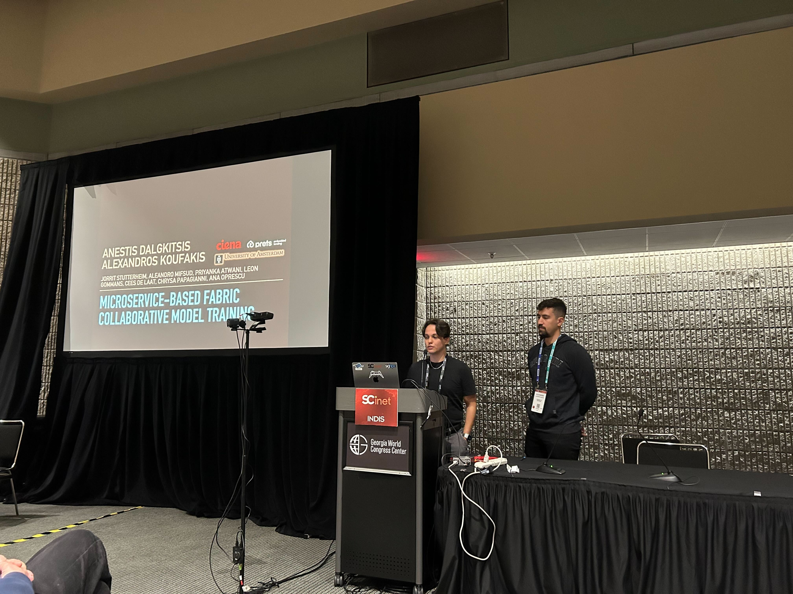
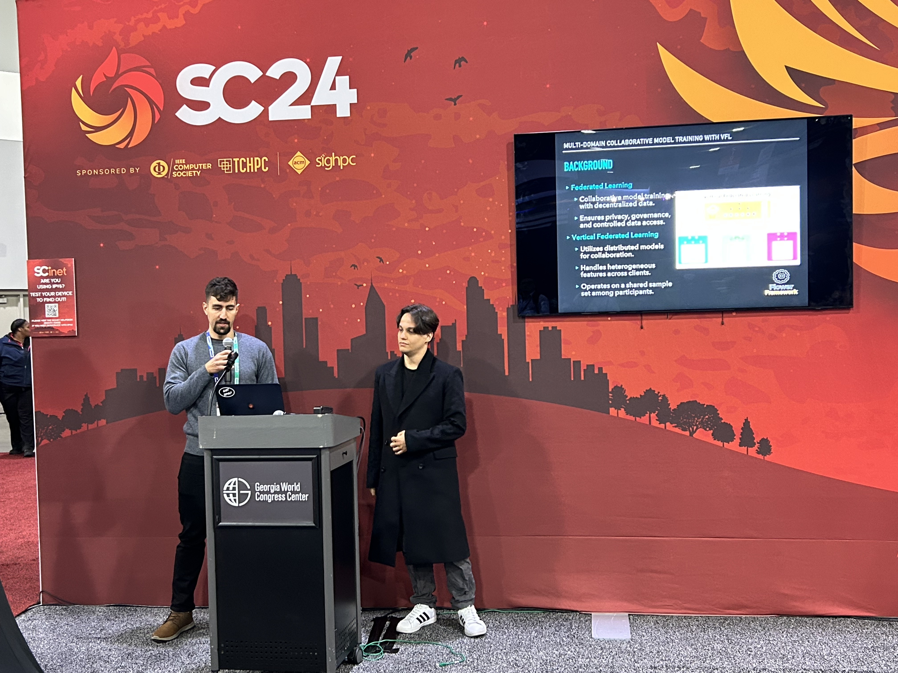

We’re thrilled to share highlights from the jointed participation of [Complex Cyber Infrastructure](https://cci-research.nl/) and [Multiscale Networked Systems](https://mns-research.nl/) in [Supercomputing 2024](https://sc24.supercomputing.org/) in Atlanta, where we demonstrated our research on microservices-based collaborative model training on the [FABRIC](https://portal.fabric-testbed.net/) testbed infrastructure. The UVA team included  [Alexandros Koufakis](https://cci-research.nl/author/alexandros-koufakis/), [Anestis Dalgitsis](https://www.linkedin.com/in/anestisdalgkitsis/), [Cees de Laat](https://cci-research.nl/author/cees-de-laat/), and [Paola Grosso](https://www.uva.nl/profiel/g/r/p.grosso/p.grosso.html) (left to right on picture).

**Monday at INDIS 2024:**
We kicked off the week by presenting our work at the [INDIS](https://scinet.supercomputing.org/community/indis/) 2024 workshop, held on November 18. Our [paper](https://github.com/Jorrit05/DYNAMOS/blob/main/docs/papers/federated_learning/INDIS_2024_Short_Paper_Final_v2_1_45.pdf), “Microservices-based FABRIC Implementation of Collaborative Model Training Scenario with Vertical Federated Learning,” tackled the challenge of using geographically distributed proprietary data for collaborative AI model training while adhering to data privacy and protection. 
Using the [DYNAMOS](https://github.com/Jorrit05/DYNAMOS) middleware and the FABRIC network, we demonstrated how the problem of building energy consumption prediction (inspired by our collaborators [Prets](https://www.prets.io/)) can be addressed using a diverse set of partners. Participants with heterogeneous datasets can collaborate to create a unified model for prediction building energy consumption, without compromising privacy or intellectual property. This solution could reinforce green energy adoption and enable more economically viable building renovation financing.
 

**Tuesday on the SCinet Stage:**
On November 19, we took to the SCinet Theater on the exhibition floor to show our ideas in action. Our [demo](https://delaat.net/sc/sc24/index.html) featured the FABRIC network's topology and showcased how Vertical Federated Learning could be used to train a model that predicts energy consumption while protecting sensitive data.
 

**Exhibition Floor Action:**
Until Thursday, November 21, we were hosted at [CIENA’s](https://www.ciena.com/) booth, where we continued to showcase our demonstration and connect with visitors from around the world.
 

**Acknowledgements:**
We couldn’t have done this without the support from [CIENA](https://www.ciena.com/) and [Prets](https://www.prets.io/). 
