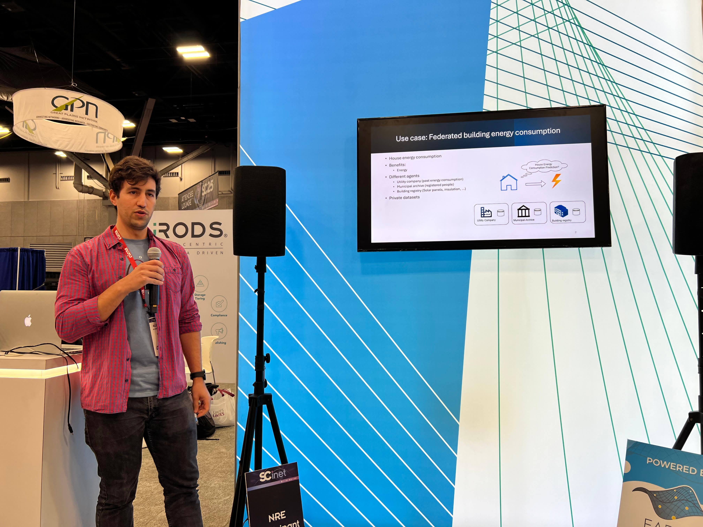
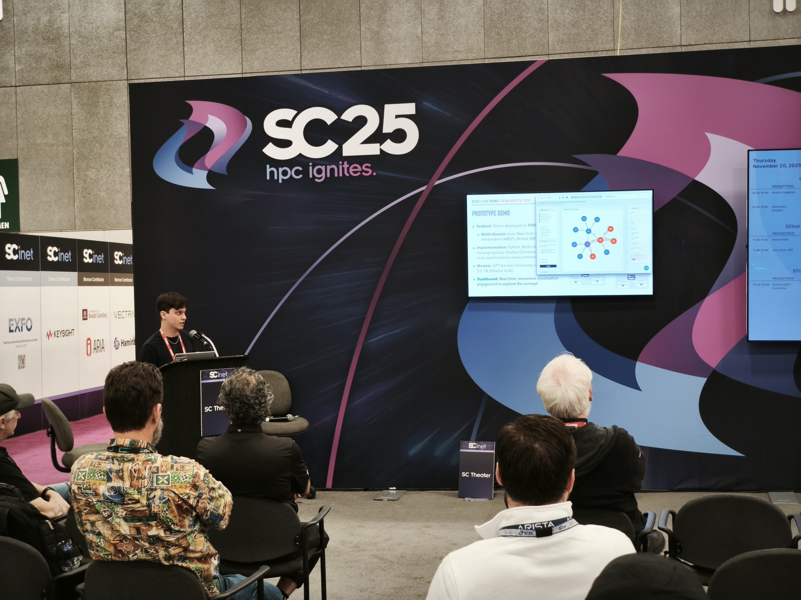

We’re happy to share some highlights from the jointed participation of [Complex Cyber Infrastructure](https://cci-research.nl/) and [Multiscale Networked Systems](https://mns-research.nl/) in [Supercomputing 2025](https://sc25.supercomputing.org/) in St Louis. The UVA team included [Sander Klous](https://cci-research.nl/author/sander-klous/), [Anestis Dalgitsis](https://www.linkedin.com/in/anestisdalgkitsis/), [Alexandros Koufakis](https://cci-research.nl/author/alexandros-koufakis/), [Cees de Laat](https://cci-research.nl/author/cees-de-laat/) (left to right on picture) and [Paola Grosso](https://www.uva.nl/profiel/g/r/p.grosso/p.grosso.html) (not pictured).

We showcased the results of two distinct research efforts. The first project, led by Anestis, focused on **LLM-Based Optimization Algorithm Selection for High-Performance Networks Orchestration**. The second, led by Alexandros, demonstrated **Policy-aware Distributed Vertical Federated Learning infrastructure**. Both works used the [FABRIC](https://portal.fabric-testbed.net/) testbed and live demonstrations took place at the [CIENA](https://www.ciena.com/) booth. The demonstrations used CIENA's mobile FABRIC node pictured above. 

The *LLM-Based Optimization* work was published and presented on the [*"Innovating the Network for Data-Intensive Science" (INDIS)*](https://scinet.supercomputing.org/community/indis/) workshop. Both projects were featured on the [RENCI](https://renci.org/) booth as examples of innovative research enabled by the FABRIC infrastructure. Additionally, they were presented on the [SciNet](https://scinethpc.ca/) theater on the exhibition floor.

*Figure 1:* RENCI presentation — [Alexandros Koufakis](https://cci-research.nl/author/alexandros-koufakis/)

*Figure 2:* SciNet presentation — [Anestis Dalgkitsis](https://www.linkedin.com/in/anestisdalgkitsis/)

## LLM-Based Optimization Algorithm Selection for High-Performance Networks Orchestration
In this work, we propose a Large Language Model (LLM)-based framework for optimization algorithm selection to address the growing complexity of high-performance, multi-domain network orchestration. The proposed solution introduces a context-aware abstraction layer where LLMs analyze network logs, service requests, and algorithm metadata to dynamically select the most suitable optimization strategy. We validate our framework through a prototype deployed on the FABRIC FAB international testbed and through simulations across diverse scenarios (eMBB, URLLC, mMTC, V2X, AR/VR), showing that LLM-driven selection achieves higher success rates and SLA compliance while balancing efficiency, accuracy, and inference latency. Our preliminary results demonstrate the feasibility of this method and highlight its potential to enable scalable, adaptive, and privacy-preserving orchestration.

[Paper and demonstration](https://delaat.net/sc/sc25/index.html)

 
## Policy-aware distributed Vertical Federated Learning infrastructure  

Harnessing the power of data is paramount to unlocking more effective applications, especially with the rise of machine learning. Data regulation, both through legislation and company policies, makes it impractical for different companies to learn from multiple datasets at once. Digital Data Marketplaces aim to solve this issue, by providing a platform where organizations can exchange data based on (dynamic) policies. The digital data marketplace enforces these policies, allowing only data exchange that does not violate policies.

In this work we demonstration how multiple geographically distributed companies can train a unified machine learning model collaboratively using Vertical Federated Learning. Towards this goal we designed and implemented Scattered Directive, a state-of-the-art distributed infrastructure deployment utilizing FABRIC, capable of automatically deploying a digital data marketplace platform. Moreover, we demonstrate the effect of dynamic data sharing policies and the impact on the universal model training.

[Demonstration](https://delaat.net/sc/sc25/index.html)  & [More material](https://github.com/DYNAMOS-UVA/.github/blob/main/Demonstration_material/SC_2025/SC2025.md) 

## Acknowledgements
We would like to thank [CIENA](https://www.ciena.com/) for their support. [RENCI](https://renci.org/) and [SciNet](https://scinethpc.ca/) for hosting our demonstrations. Finally, we would like to acknowledge that part of this work was supported by the project: [*Budget-neutral sustainable home improvements (MOOI-224049)*](https://www.prets.io/)
